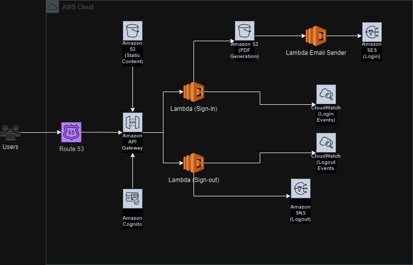

# ascendia-test
testing for ascendia

## High Level Design for the Construction Site API

## Entity Relationship Design for the Construction Site API

Resources used

# Route53

Sets the DNS Record for the Construction Site API

# API Gateway

REST API that handles the requests made for the Construction Site Logins. Forwards requests to the Cognito for Authentication and Lambda for further processing

# AWS Cognito

Uses User pools to handle the authenticatoni. Returns with an authentication token that will authorize the login for the construction employees

# Lambda

Processes the requests (login/logout) of the employees. Login methods create PDFs that are stored

# S3 Buckets

Used as a storage for the static website for login, and for the PDF files generated. For every generated PDF file, an event triggers SES

# SES

Used to send the PDF files generated by the Lambda and added in S3. For every generated PDF file, an event triggers SES

# SNS

Used to send notification to the manager for every logout made by an employee